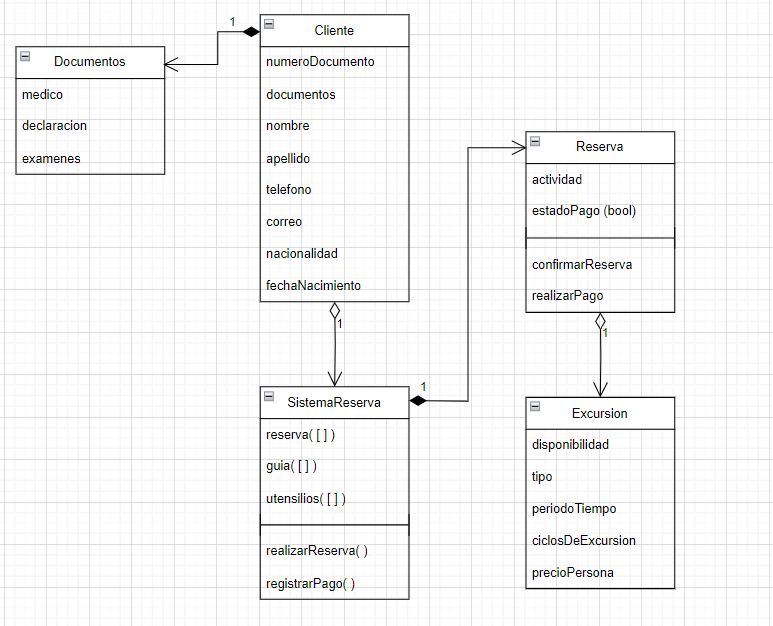
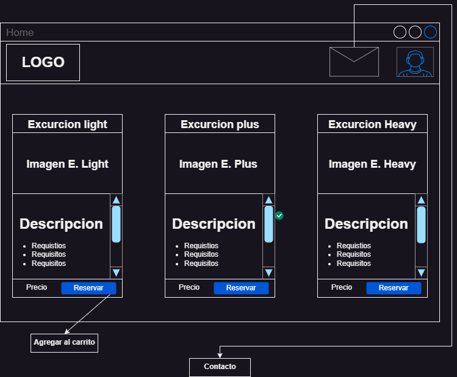

# Sistema de Reserva de Excursiones
Complejo Turístico: Agencia de Turismo.

Desarrollo de "Proyecto" de Taller de Programación Aplicada (Sprint 1).

Trabajo hecho en Python, bajo el framework PyQt6.

Grupo 9: Gerardo Cerón, Dante Farfán, Massimo Larger, Diego Molina, Daniel Sepulveda.

---

# **Documentación**

Éste es el manual de usuario para el `Sistema de Reserva de Excursiones`.

# **Índice**

1. [Diagramas](#diagramas)
  1. [Diagrama de Clases](#diagrama-de-clases)
  2. [Mockup](#mockup)
2. [Instrucciones](#instrucciones)
  1. [Clonar](#clonar)
  2. [Repositorio Local](#repositorio-local)
  3. [Ejecución](#ejecución)

## **Diagramas**

Diagramas realizados para tener una base en la que crear el programa.

### **Diagrama de Clases**

### **Mockup**

## **Instrucciones**
Ésto es una guía de usuario para poder ejecutar el programa, el cuál se recomienda seguir paso por paso para minimizar los problemas que se puedan generar durante la ejecución. Cabe recalcar que se asumirá que se tiene `Python` ya instalado, además de que éste será en su última versión estable.

### **Clonar**

Primero hay que descargar el repositorio desde la pestaña `<> Code` (de color verde) y seleccionando el `Download ZIP`. Al finalizar la descarga hay que descomprimir el contenido y entrar a la carpeta creada.

### **Repositorio Local**

Ya entrando a la carpeta creada al haber descomprimido el `ZIP` tendremos que entrar a la línea de comandos, en específico desde la carpeta descomprimida, hacer click derecho dentro y clickear `Abrir en Terminal`, abriéndose así el `CMD` de Windows en la dirección indicada. Para asegurarse de que estés en la ubicación necesaria, debes fijarte de que la dirección sea:
> ...\Sis-ReservaExcursiones>

### **Ejecución**

Para lograr ejecutar este programa debemos ingresar en el `CMD` lo siguiente:
> ...\Sis-ReservaExcursiones> python Codigos\main.py

¡Felicidades, ejecutaste el programa!
